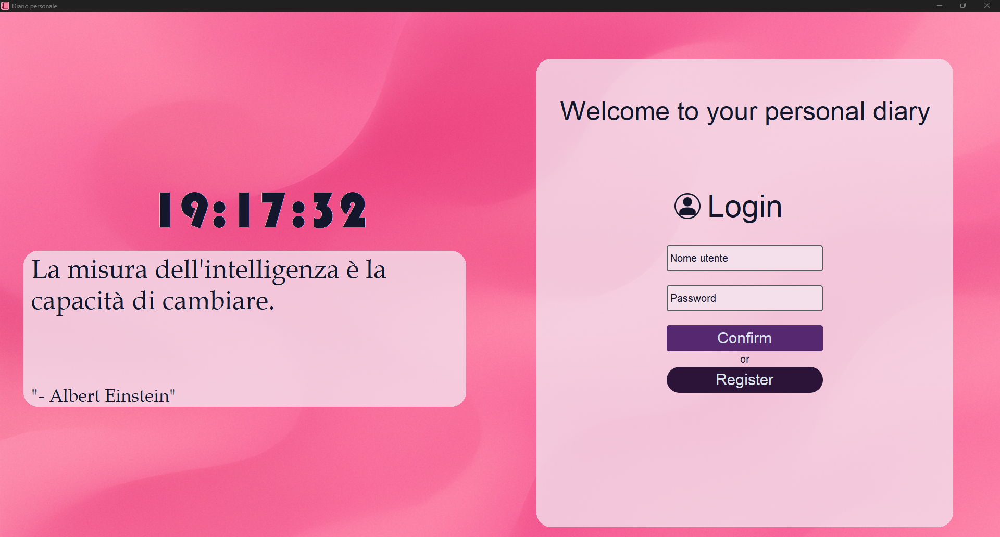
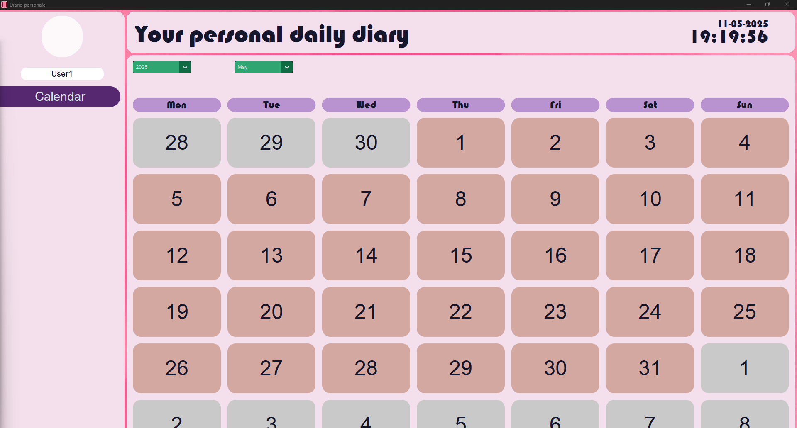
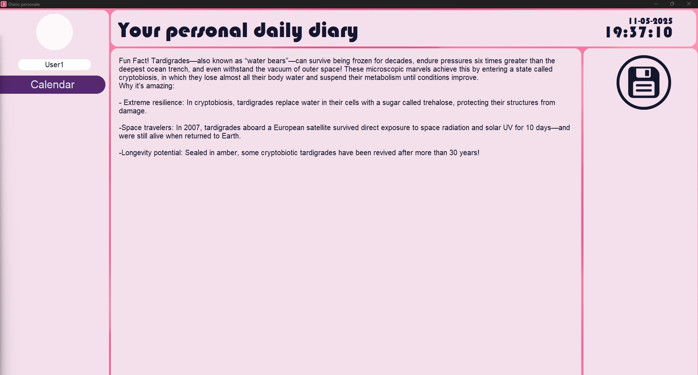
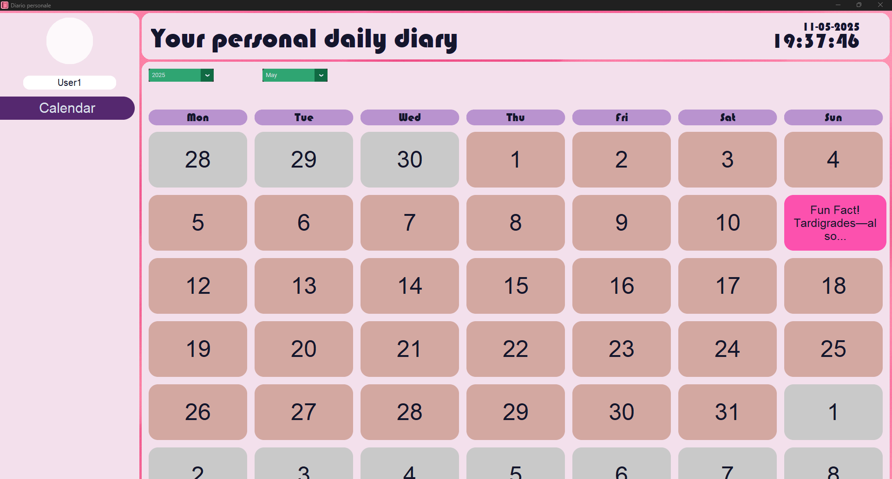
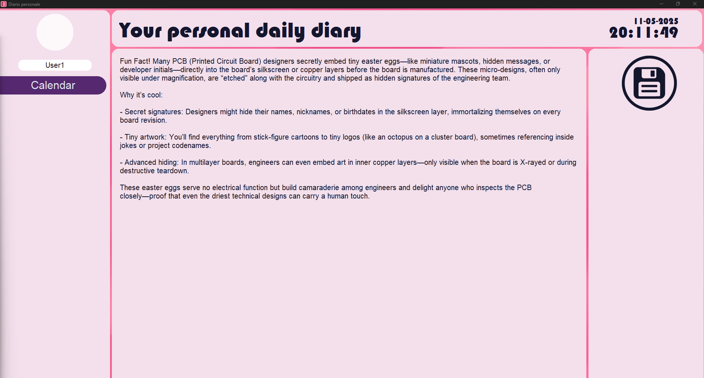
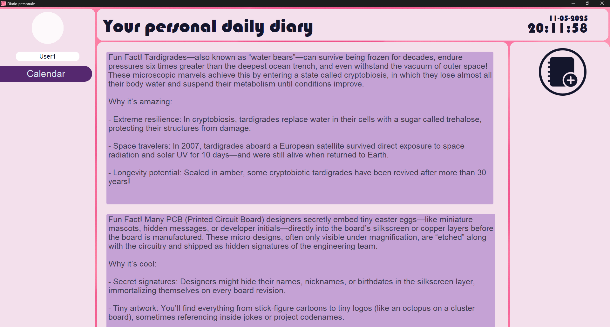
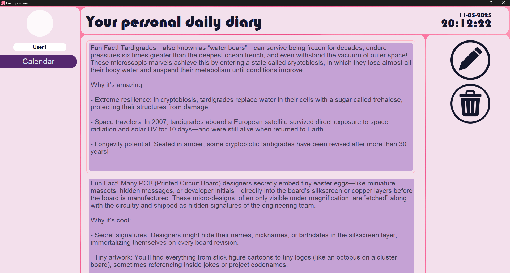
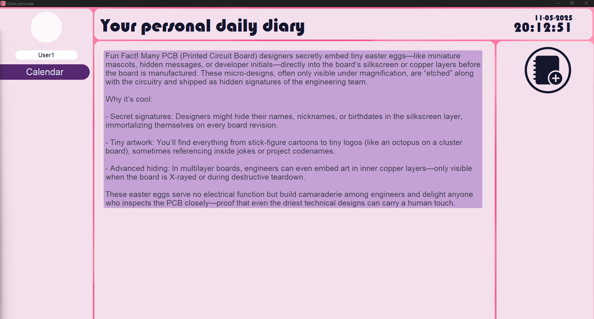

  
  <h1>Daily Journal Proof-of-Concept</h1>

# Table of Contents

- [About the Project](#about-the-project)
  * [Project Description](#project-description)
  * [Screenshots](#screenshots)
  * [Features](#features)
- [Getting Started](#getting-started)
  * [Installation](#installation)
  * [Run Locally](#run-locally)
- [License](#license)
- [Third Party Licenses](#third-party-licenses)

## About the Project

### Project Description

This application is a side project that i've made for my girlfriend made completely in Python. It's a digital diary featuring a CustomTkinter graphical interface and an SQL back end for robust data management. Uniquely, it incorporates the pvInStyle library—enabling smooth fade-in/fade-out animations and sophisticated page transitions. As a result, each button can orchestrate entire pages of complex elements rather than single widgets, yielding a more dynamic, modern, and well-structured user experience.
The use of SQL authentication allows multiple users to maintain separate, password-protected diaries, ensuring privacy and security.

Originally conceived as a personal project, this prototype evolved into a comprehensive proof of concept. Please note that it is intended solely to demonstrate feasibility and is not distributed for production use.

### Screenshots
  

  

  

  

  

  

  

  

  

## Getting Started

### Installation

### Run Locally

## License

## Third Party Licenses

